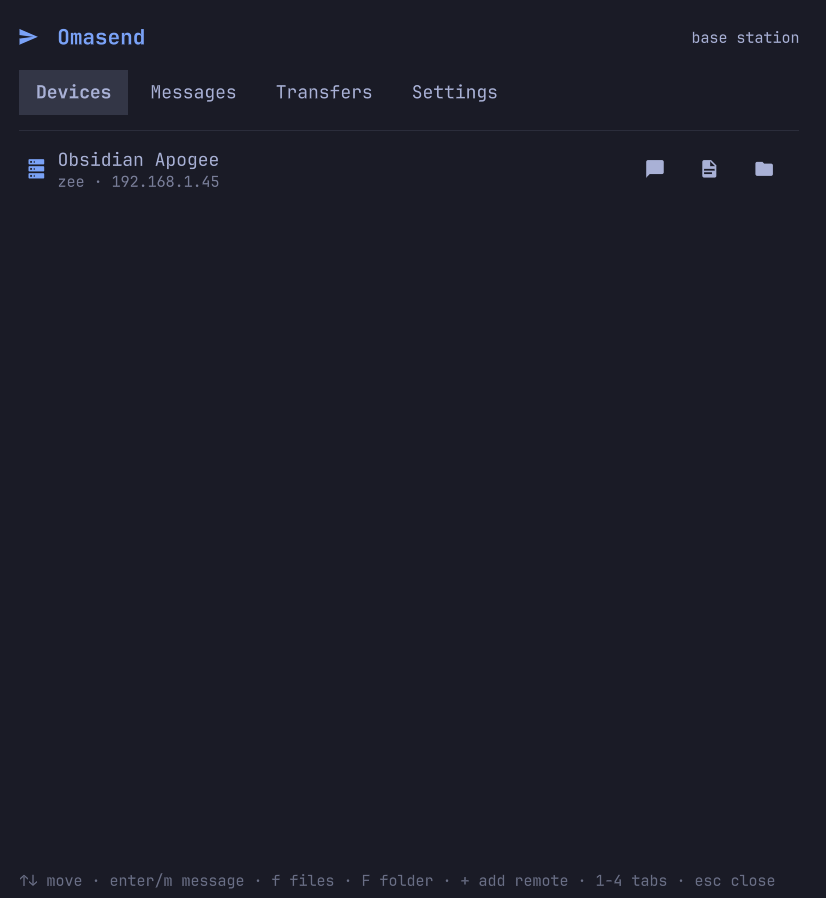
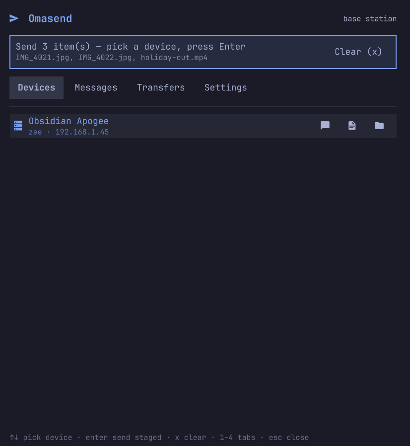
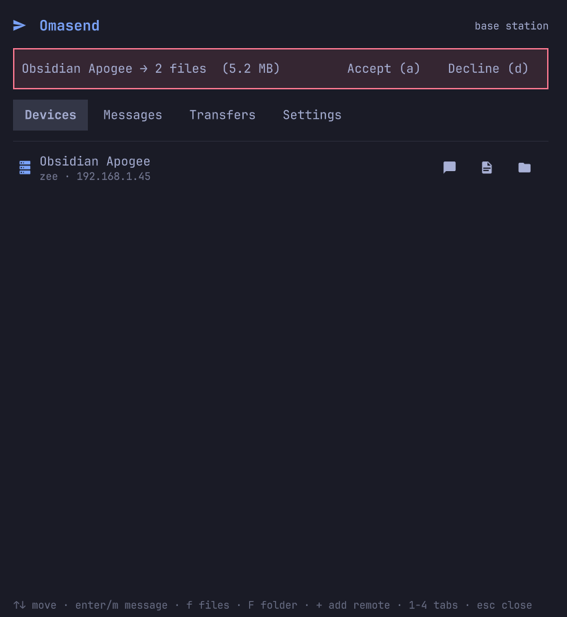

# Omasend

Send and receive files and messages between your Omarchy desktop and anything
running [LocalSend](https://localsend.org) — phones, laptops, other Linux
boxes — without opening an app. Omasend is a **native plugin for the Omarchy 4
desktop shell** (`omarchy-shell`): a paper-plane icon in the bar, a panel for
devices, messages and transfers, and an always-on receiver that runs quietly
with the shell.

It speaks the LocalSend v2.1 protocol, including the default encrypted (HTTPS)
mode, so stock LocalSend apps see it as just another device.

<p align="center">
  
  
  
</p>

## Quick start

On an Omarchy 4 desktop, paste this into a terminal:

```sh
curl -fsSL https://raw.githubusercontent.com/28allday/omasend-quattro/main/install.sh | bash
```

That's the whole install. When it finishes you'll have a paper-plane icon in
the bar — click it and the panel opens on the Devices tab.

Then, on the devices you want to talk to:

- **Phone or tablet** — install the free [LocalSend app](https://localsend.org)
  (iOS / Android). On the same Wi-Fi, it and your desktop find each other
  automatically.
- **Another desktop or laptop** — the official LocalSend app, or Omasend on
  another Omarchy 4 box.
- **A headless server** — the
  [omarchy-send](https://github.com/28allday/omarchy-send) terminal client.

Send something from the other device and it appears as an offer in the panel;
accept it and it lands in `~/Omasend`. That's it.

## Highlights

- **Always receiving** — if the desktop is running, the box can receive. Files
  land in `~/Omasend`, and a desktop notification tells you when they arrive.
- **Bar icon** — a paper plane in the bar; it badges on unread messages and
  active transfers, and a click opens the panel.
- **Send anything** — pick a device and press `f` for files or `Shift+F` for a
  whole folder (sent recursively, structure preserved), or right-click files
  in Nautilus → **Send via Omasend** to open the panel with your selection
  already staged.
- **Messages** — LocalSend-compatible plain-text messages in both directions:
  compose from a device row, read in the Messages tab.
- **You stay in control** — incoming offers show an accept/decline strip
  (auto-accept is optional), and an optional PIN gates who can send to you.
- **Finds devices anywhere** — multicast discovery on the LAN, automatic
  [Tailscale](https://tailscale.com) peers, and manual add-by-host/IP for
  everything else.
- **Scriptable** — send files or messages from scripts and AI agents through
  the shell's IPC, no UI involved.

## Requirements

Omarchy 4 with `omarchy-shell` — the UI is a shell plugin. On a headless or
pre-quattro box the panel can't run; use the original
[omarchy-send](https://github.com/28allday/omarchy-send) terminal client
there instead. Both speak the same protocol and happily talk to each other.

## Install details

The one-liner from Quick start installs the transfer engine
(`omasend-engine`, a single static binary in `~/.local/bin`), registers and
enables the shell plugin, and adds the icon and the Nautilus right-click
entry. It also installs [zenity](https://gitlab.gnome.org/GNOME/zenity) if
it's missing (asks for sudo) — that's the graphical chooser behind the
panel's "Send file/folder" buttons; without it they fall back to a typed-path
prompt. It's safe to run again; `omarchy plugin update` keeps the plugin
itself up to date.

Prefer to build from source? Clone the repo and run the same script — with Go
installed it builds the engine locally instead of downloading it:

```sh
git clone https://github.com/28allday/omasend-quattro.git
cd omasend-quattro && bash install.sh
```

Overrides: `BIN_DIR=…` puts the engine somewhere else, `OMASEND_VERSION=v0.1.0`
pins a release, `OMASEND_REPO=user/repo` installs from a fork.

**Coming from omarchy-send?** Your identity survives: the first run migrates
`~/.config/omarchy-send/config.json` — alias, PIN, receive folder and the TLS
certificate — so devices that already paired with you stay paired. The old TUI
and Omasend can't run at the same time on one machine (both need port 53317).

## Using it

Click the paper plane in the bar, or from a terminal:

```sh
omarchy-shell shell toggle nosignal.omasend
```

The panel is fully keyboard-driven:

| Key | Action |
| --- | --- |
| `↑` `↓` / `j` `k` | Move through the list |
| `Enter` / `m` | Message the selected device (sends staged items instead, if any are staged) |
| `f` / `Shift+F` | Pick files / a folder to send to the selected device |
| `+` | Add a remote device by host or IP |
| `a` / `d` | Accept / decline an incoming offer |
| `x` | Clear staged items |
| `1`–`4` / `Tab` | Switch tabs |
| `Esc` / `q` | Close the panel |

Every row also works with the mouse — the icons on a device row send a
message, files, or a folder directly.

### Receiving

Anything sent to you lands in `~/Omasend`. Files still on their way carry a
`.part` suffix until they're complete. With auto-accept off (the default),
each incoming batch shows an offer strip at the top of the panel — accept or
decline it; unattended offers simply expire. Flip **Auto-accept** in Settings
if you'd rather everything just arrives.

Set a **PIN** in Settings and senders must enter it before anything reaches
you — the same PIN mechanism the official LocalSend apps use.

### Messages

Incoming messages raise a notification and badge the bar icon; the Messages
tab keeps the recent conversation (messages live in the panel, not on disk).
Press `Enter` on a device to reply.

### Transfers

The Transfers tab shows live progress for everything moving in either
direction. Dismiss finished rows individually, or press `c` to clear all
finished transfers.

### Right-click in Nautilus

Select files or folders in Nautilus, right-click → **Send via Omasend**. The
panel opens with your selection staged — pick a device, press `Enter`, done.

### Remote devices

Multicast discovery only reaches your own LAN. For everything else: online
Tailscale peers are discovered automatically when Tailscale is running, and
`+` adds any device by host or IP, remembered for next time.

### From scripts and agents

The shell exposes Omasend over IPC, so anything on the box can send without a
UI or a TTY:

```sh
omarchy-shell omasend send "phone" "on my way"          # message
omarchy-shell omasend sendFile "phone" "/path/to/file"  # file or folder
omarchy-shell omasend status                            # engine health
```

Sends are queued and delivered asynchronously; a failure raises a desktop
notification. The installer also writes a managed block into
`~/.claude/CLAUDE.md` so AI agents on the machine know how to use it.

## Under the hood

Two parts: a pure-QML shell plugin (bar widget, panel, service) and
`omasend-engine`, a small Go daemon that speaks the LocalSend protocol —
discovery, HTTPS transfers, PIN, the lot. The shell starts and supervises the
engine and talks to it over a local socket; nothing listens beyond LocalSend's
standard port `53317` (TCP + UDP). Configuration lives in
`~/.config/omasend/config.json`. If you run a firewall, allow `53317` for both
TCP and UDP on your LAN.

## Uninstall

```sh
omarchy plugin remove nosignal.omasend
rm ~/.local/bin/omasend-engine
rm ~/.local/share/nautilus-python/extensions/omasend.py
```

## License

MIT — see [LICENSE](LICENSE). Omasend is an independent project, not
affiliated with or endorsed by LocalSend; it merely speaks the same protocol.
